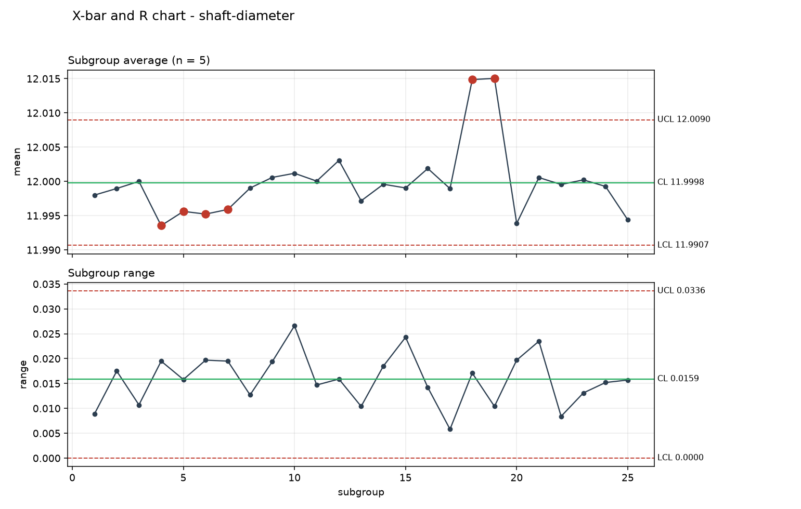

# spc-toolkit

A command line tool that turns a CSV of measurements into an X-bar/R control chart, capability indices and a list of Nelson rule violations. It exits non-zero when the process is not in control, so it can sit in a pipeline rather than only being run by hand.

## Why I wrote it

I wanted the capability numbers and the control chart to come from the same code path. In practice Cp and Cpk usually get worked out in a spreadsheet using the overall standard deviation, which quietly turns them into Pp and Ppk and makes a drifting process look better than it is. Here the within-subgroup sigma comes from R-bar over d2 and the overall one from the raw sample, both indices are printed side by side, and the summary says something when they disagree.

The Nelson rules were the other reason. Reading "point outside the limits" off a chart is easy; spotting nine points on one side of the centre line, or four of five past one sigma, is not something anyone does reliably by eye.

## Running it

Python 3.10 or newer.

```bash
pip install -r requirements.txt
python -m spc data/shaft-diameter.csv --lsl 11.970 --usl 12.030
```

That writes `out/control-chart.png` and prints the summary. Spec limits are optional — leave them out and you get the control chart and the rule check without capability indices. `--report FILE` saves the summary next to the chart, and `--no-chart` skips the PNG.

The exit code is 0 when no rule fires and 1 when one does, which is what makes `python -m spc ... && deploy` behave sensibly.

### Output for the bundled sample



```
Control limits
  X-bar           CL 11.9998  LCL 11.9907  UCL 12.0090
  Range           CL 0.0159  LCL 0.0000  UCL 0.0336

Variation
  sigma (within)  0.00683   from R-bar / d2
  sigma (overall) 0.00788   sample standard deviation

Capability
  Spec limits     11.97 .. 12.03
  Cp   1.464      Cpk  1.455
  Pp   1.270      Ppk  1.262
  Verdict         Cpk 1.46 - capable

Nelson rules
  Rule 1: One point beyond three sigma
    subgroups 18, 19
  Rule 5: Two of three consecutive points beyond two sigma on the same side
    subgroups 18, 19
  Rule 6: Four of five consecutive points beyond one sigma on the same side
    subgroups 4, 5, 6, 7
```

## Input format

Long format, one measurement per row:

```csv
subgroup,value
1,11.9981
1,12.0043
```

Every subgroup has to hold the same number of readings, and that number has to be between 2 and 10 because the d2/A2/D3/D4 constants are only tabulated over that range. Column names are configurable with `--subgroup-column` and `--value-column`.

## The sample data

`data/shaft-diameter.csv` is invented, not measured. It is 25 subgroups of 5 readings of a shaft diameter with a nominal of 12.000 mm and a tolerance of ±0.030 mm. Subgroups 18 and 19 were pushed roughly 0.014 mm high to stand in for a bad bar stock lot, which is what rules 1 and 5 pick up. The cluster that rule 6 flags around subgroups 4 to 7 was not planted — it is ordinary noise, and it is a fair illustration of how often the sensitive rules fire on a process that is actually fine.

## Project structure

```
spc/
  constants.py    d2, A2, D3, D4 by subgroup size
  statistics.py   control limits, sigma estimates, Cp/Cpk/Pp/Ppk
  nelson.py       the eight rules
  data.py         CSV loading and validation
  charts.py       matplotlib output
  report.py       the text summary
  cli.py          argparse entry point
data/             the sample measurements
tests/            unit tests for all of the above
```

## Known gaps

Only X-bar/R is implemented. There is no X-bar/S for larger subgroups, no individuals-and-moving-range chart for the common case where you measure one part at a time, and no attribute charts (p, np, c, u) at all.

Nothing checks whether the data is normal. Cp and Cpk assume it is, and on a skewed or bimodal process the numbers here will be confidently wrong. There is no histogram or probability plot to eyeball that with.

The control limits are calculated from the same data being judged, so the out-of-control subgroups inflate the limits they are then compared against. Proper practice is to establish limits from a known-good baseline period and freeze them; there is no way to pass in limits from a previous study.

Nelson rules are only applied to the X-bar chart. The range chart gets its limits drawn but no rule checking, and rules 2 and 3 are arguably worth running on it.

The constants stop at subgroup size 10. Anything larger is rejected rather than falling back to an X-bar/S chart, which is what should really happen.

There is no measurement system analysis. Gauge R&R would tell you how much of that sigma is the process and how much is the gauge, and without it the capability numbers are an upper bound at best.

Everything is loaded into memory at once and the chart is a single static PNG. There is no streaming, no database input, no interactive output, and no way to plot more than one characteristic in a run.

## License

MIT, see [LICENSE](LICENSE).
